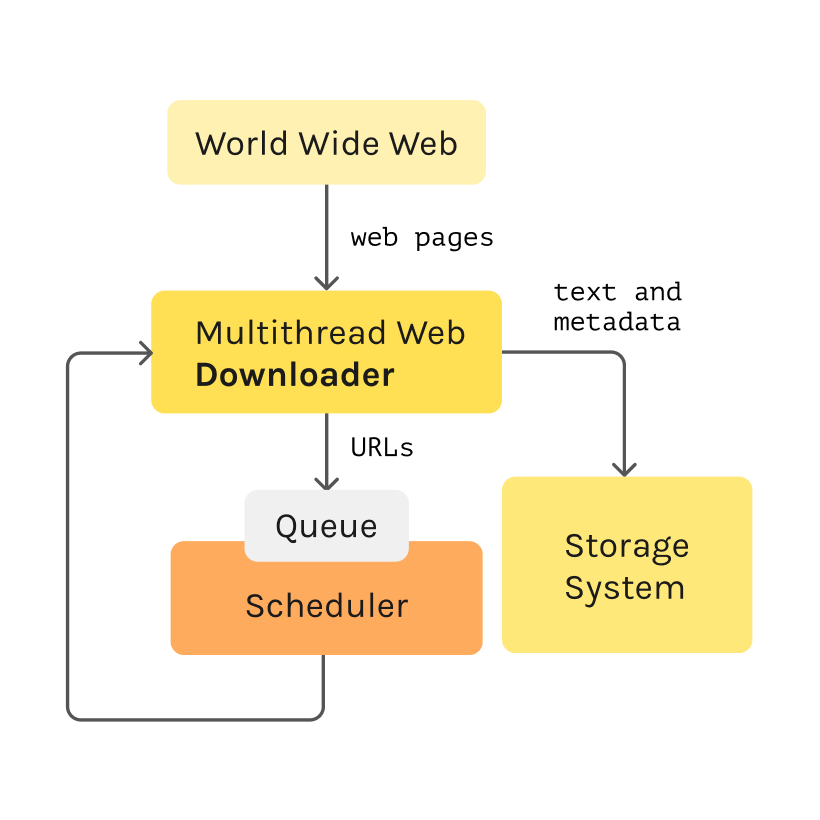

# Web Crawlers and Web Scraping
### Brief History

**1989**: Internet was created

**1993**:  [WWWWanderer](https://www.wikiwand.com/en/World_Wide_Web_Wanderer) was created to measure the size of the Web.

**1993**: [JumpStation](https://www.wikiwand.com/en/JumpStation), the first search engine based on web crawler techniques.

**2000**: First Web API and API Crawler

### Definitions

**Web Crawler**: Internet bot that systematically browses the World Wide Web. Below Image contains the basic components and interactions of a web crawler.

**Data Scraping**: Is a technique in which a computer program extracts data from human redable output coming from another computer.

**Types of Data Scraping**: 

* Screen scraping, *artificial vision, image processing*

* Report mining, *logs, data dump*

* Web scraping, *webpages, web content*

* Manual scraping, *copy and paste*

**Web Scraping**: Is data scraping used for extracting data from websites.

### Interesting thigs around web scraping 

* **WebHose**, a top level web crawler that turn an structured web content into content to consume on demand via APIs. [https://webhose.io].
* **PromptCloud**, customized web scraping solutions. [https://www.promptcloud.com].
* **Apify**, Extract data from any website. [https://apify.com].
* **Dataflowkit**, Helps people to Automate data workflows on the web, process and transform data at any scale. [https://dataflowkit.com].
* **Import.io**, Helps the world’s largest companies strategize for success with smart web-data. [https://www.import.io].

### Development Things

**Ultimate Facebook Scraper**

A bot which scrapes almost everything about a Facebook user's profile including all public posts/statuses available on the user's timeline, uploaded photos, tagged photos, videos, friends list and their profile photos (including Followers, Following, Work Friends, College Friends etc).

https://github.com/harismuneer/Ultimate-Facebook-Scraper

**Twint**

An advanced Twitter scraping & OSINT tool written in Python that doesn't use Twitter's API, allowing you to scrape a user's followers, following, Tweets and more while evading most API limitations.

https://github.com/twintproject/twint

**Scrapy**

An open source and collaborative framework for extracting the data you need from websites. In a fast, simple, yet extensible way.

https://scrapy.org

**Twitter Scraper**

Scrape the Twitter Frontend API without authentication with Golang.

https://github.com/n0madic/twitter-scraper

**Ferret**

A web scraping system aiming to simplify data extraction from the web.

https://www.montferret.dev
